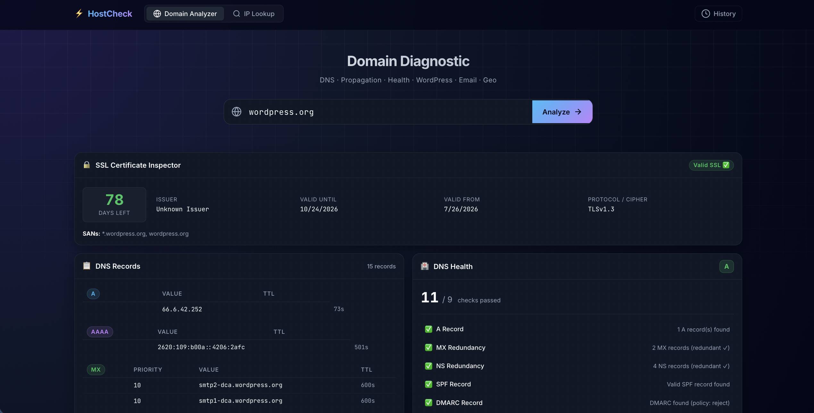
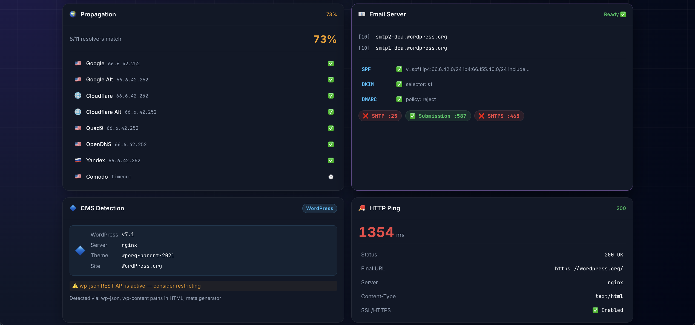
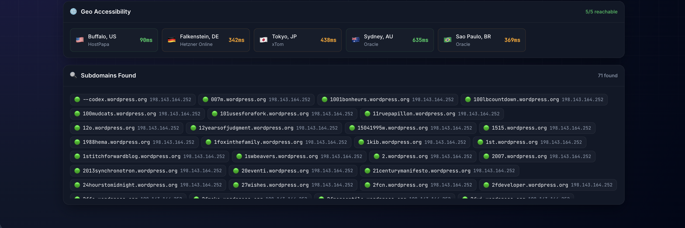

# ⚡ HostCheck

**All-in-one hosting diagnostic tool.** Built as a first-layer check when handling domain or email complaints — instead of jumping between multiple tools, just enter a domain and get everything at once.

> Built as a portfolio project for technical support roles in hosting companies.

---

## Why

When a customer reports an issue with their domain or email, the first thing you do is check DNS, propagation, SPF, DMARC, whether it's WordPress, whether the server is up, etc. That usually means opening 4–5 different tools.

HostCheck consolidates all of that into one place. One domain input, one click, all the data you need.

---

## Features

### 🌐 Domain Analyzer
| Feature | Details |
|---|---|
| **SSL Inspector** | Certificate validity, issuer, days left, valid dates, SANs |
| **Subdomain Discovery**| Finds subdomains + resolved IPs via HackerTarget & DNS probe |
| **DNS Full Check** | A, AAAA, MX, TXT, NS, SOA, CAA, PTR — with TTL |
| **DNS Health Score** | 9-point scoring system with letter grade (A–F) |
| **DNS Propagation** | Checks 11 global resolvers including Telkom & Nawala ID |
| **Email Server** | MX, SPF, DKIM, DMARC check + SMTP port reachability |
| **WordPress Detection** | Version, PHP, server type, exposed readme/wp-json |
| **HTTP Ping** | Response time, status code, SSL status, redirect chain |
| **Geo Accessibility** | Tests from 5 continents via GlobalPing |

### 🔍 IP Lookup
| Feature | Details |
|---|---|
| **Geolocation** | Country, city, ISP, ASN, timezone via ip-api.com |
| **Abuse Score** | AbuseIPDB confidence score with risk level (Low/Medium/High) |
| **Abuse Reports** | Last 10 reports with category and reporter country |

### 🕐 History
- Searches saved in browser `localStorage`
- Re-run previous checks in one click from the history drawer

---

## Tech Stack

- **Backend** — Python serverless functions (`api/*.py`)
- **Frontend** — Plain HTML + CSS + JS (no framework)
- **Deploy** — Vercel

---

## Project Structure

```
hostcheck/
├── api/
│   ├── ssl_check.py     # SSL certificate inspector
│   ├── subdomains.py    # Subdomain discovery
│   ├── dns.py           # DNS records
│   ├── propagation.py   # Global propagation check
│   ├── health.py        # DNS health scoring
│   ├── wordpress.py     # CMS detection
│   ├── email.py         # Email server check
│   ├── ip.py            # IP reputation
│   ├── ping.py          # HTTP ping
│   └── geo.py           # Geo accessibility
├── index.html
├── style.css
├── app.js
├── dev.py               # Pure Python local dev server
├── vercel.json
└── requirements.txt
```

---

## Local Development

**Prerequisites:** Python 3.9+, [Vercel CLI](https://vercel.com/docs/cli)

```bash
# Clone & setup
git clone https://github.com/yourusername/hostcheck.git
cd hostcheck

# Install Python deps
python3 -m venv .venv
source .venv/bin/activate
pip install -r requirements.txt

# Create .env with your API keys
cp .env.example .env
# → Fill in ABUSEIPDB_API_KEY and URLSCAN_API_KEY

# Run locally
vercel dev
```

Open `http://localhost:3000`

---

## Environment Variables

| Variable | Required | Source |
|---|---|---|
| `ABUSEIPDB_API_KEY` | Yes | [abuseipdb.com/register](https://www.abuseipdb.com/register) |
| `URLSCAN_API_KEY` | Optional | [urlscan.io/user/signup](https://urlscan.io/user/signup) |

Set these in Vercel dashboard under **Settings → Environment Variables**.

---

## Deploy to Vercel

```bash
vercel --prod
```

Done. All `api/*.py` functions deploy automatically as serverless endpoints.

---

## External APIs Used

| API | Purpose | Auth |
|---|---|---|
| [ip-api.com](https://ip-api.com) | IP geolocation | Free, no key |
| [AbuseIPDB](https://www.abuseipdb.com) | IP reputation | Free tier, key required |
| [GlobalPing](https://www.jsdelivr.com/globalping) | Geo accessibility | Free, no key |
| `dnspython` | All DNS queries | Python library |

---

## Note on Performance

This project is deployed on **Vercel serverless** purely as a portfolio showcase. Serverless has some known limitations for this kind of tool:

- **Cold starts** — first request after idle can be slow
- **10s timeout** on hobby plan (geo check may return partial results)
- **No persistent connections** — each request spins up fresh

In a real production environment, I'd run this on a **VPS** (always-on Python process, no cold starts, full ICMP support for real ping & traceroute, SQLite for persistent history). This version is just here so the work is visible and accessible. 😄

---

## Screenshots & Preview

<p align="center">
  
</p>

<p align="center">
  
</p>

<p align="center">
  
</p>

---

## License

MIT
